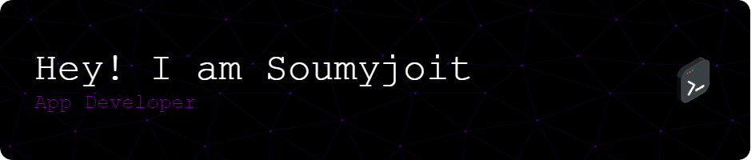

# About Me 👋🏼

- 💻 Currently building Flutter apps
- 🎓 Studying Computer Science at UEM
- 🎮 Currently learning game dev with Godot
- 🎥 Film enthusiast and language learner

# 💻 Tech Stack

#### **💻 Programming and Development**

       
     
   

#### **🛠️ Tools and Platforms**

   
    
   

#### **📊 Data and Machine Learning**  

   
   
    
  

#### **🌐 Networking, IoT, and Game Development**  

   

# 📊 GitHub Stats

  
  
  

<picture>
  <source media="(prefers-color-scheme: dark)" srcset="https://raw.githubusercontent.com/CrayFIsh0/CrayFish0/output/github-snake-dark.svg" />
  <source media="(prefers-color-scheme: light)" srcset="https://raw.githubusercontent.com/CrayFIsh0/CrayFIsh0/output/github-snake.svg" />
  
</picture>

## 🌐 Socials

---

### 🌍 Visitor Count

