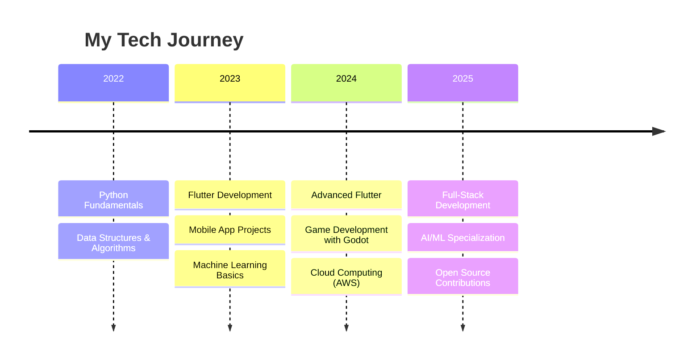

<div align="center">
  
</div>

<h1 align="center">
  
</h1>

<div align="center">
  
</div>

<p align="center">
  
</p>

<div align="center">
  
  
  
</div>

## 🚀 About Me

<table>
<tr>
<td width="50%">

### 🎯 Current Focus

- 🔭 **Building:** Next-gen Flutter applications with cutting-edge UI/UX
- 🎓 **Studying:** Computer Science at UEM | Data Structures & Algorithms
- 🎮 **Exploring:** Game development with Godot Engine & C#
- 🎬 **Passion:** Film enthusiast & polyglot (English, Spanish, learning Japanese)
- 💡 **Philosophy:** Code with purpose, design with empathy
- 🌱 **Goal:** Contributing to open-source & building tech that matters

### 🎲 Fun Facts

- 🦀 Named after a crustacean (obviously!)
- ☕ Powered by coffee and curiosity
- 🌙 Night owl programmer (peak productivity: 11 PM - 3 AM)
- 🎵 Code soundtrack: Lo-fi hip hop & synthwave
- 🏆 Debugging level: Rubber duck whisperer

</td>
<td width="50%">

<div align="center">

### 📊 Live Coding Stats


### 🎵 Currently Vibing To


### 🌍 Visitor Map


</div>

</td>
</tr>
</table>

<div align="center">
  
</div>

<h1 align="center">
  
</h1>

<div align="center">
  
</div>

<details>
<summary>
  <h2 style="display: inline;">🎯 Interactive Skill Matrix</h2>
</summary>

<table>
<tr>
<td width="33%">

### 💻 **Core Programming**
```python
class Developer:
    def __init__(self):
        self.languages = {
            'Python': {'level': 9, 'years': 3},
            'Dart': {'level': 8, 'years': 2},
            'JavaScript': {'level': 8, 'years': 2},
            'C++': {'level': 7, 'years': 2},
            'Java': {'level': 7, 'years': 1},
            'C': {'level': 6, 'years': 1}
        }
        
    def get_favorite(self):
        return "Python 🐍 & Dart 🎯"
```

</td>
<td width="34%">

### 🛠️ **Frameworks & Tools**
```javascript
const techStack = {
  mobile: ['Flutter', 'Dart SDK'],
  web: ['Node.js', 'TailwindCSS'],
  databases: ['MongoDB', 'MySQL'],
  cloud: ['AWS', 'Firebase'],
  ml: ['TensorFlow', 'Pandas', 'NumPy'],
  design: ['Figma', 'Krita'],
  gamedev: ['Godot Engine'],
  hardware: ['Raspberry Pi', 'Arduino']
};

console.log('Currently mastering:', techStack);
```

</td>
<td width="33%">

### 📊 **Skill Progression**


</td>
</tr>
</table>

### 🎮 **Interactive Technology Timeline**


</details>

<div align="center">
  
</div>

## 📊 GitHub Analytics

<div align="center">
  
  
</div>

<div align="center">
  
</div>

### 🐍 Contribution Snake

<div align="center">
  <picture>
    <source media="(prefers-color-scheme: dark)" srcset="https://raw.githubusercontent.com/CrayFIsh0/CrayFish0/output/github-snake-dark.svg" />
    <source media="(prefers-color-scheme: light)" srcset="https://raw.githubusercontent.com/CrayFIsh0/CrayFish0/output/github-snake.svg" />
    
  </picture>
</div>

<div align="center">
  
</div>

## 🏆 Achievements & Trophies

<div align="center">
  
</div>

## 📈 Coding Activity

<div align="center">
  
</div>

## 🎯 Current Projects

<div align="center">

| Project | Description | Tech Stack | Status |
|---------|-------------|------------|--------|
| 🚀 **FlutterCraft** | Cross-platform mobile app with stunning UI | Flutter, Dart, Firebase | `In Progress` |
| 🎮 **PixelQuest** | 2D indie game with procedural generation | Godot, GDScript, C# | `Planning` |
| 🤖 **AIHelper** | ML-powered productivity assistant | Python, TensorFlow, OpenAI | `Prototype` |
| 📱 **CodeSnippet Manager** | Developer productivity tool | Flutter, SQLite, Cloud | `Beta` |

</div>

## 🤝 Connect With Me

<div align="center">
  
[](mailto:cray.fish.75.02@gmail.com)
[](https://linkedin.com/in/crayfish0)
[](https://crayfish0.dev)
[](https://discord.gg/crayfish0)

</div>

<div align="center">
  
</div>

<div align="center">
  
### 💫 Thanks for visiting! 


**"First, solve the problem. Then, write the code." – John Johnson**

</div>

<div align="center">
  
</div>
